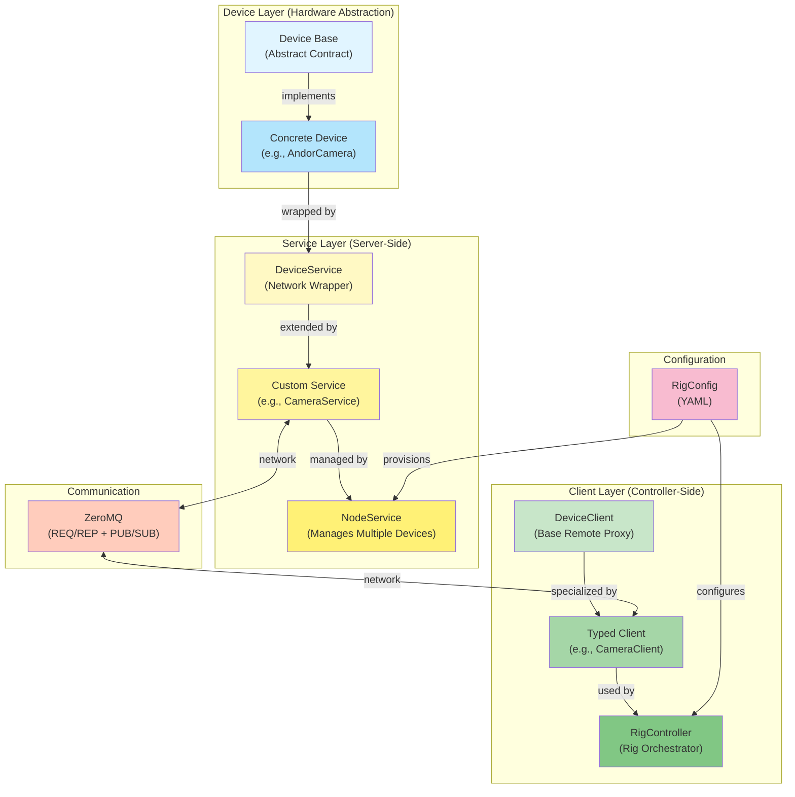

# PyRig - Distributed Device Control Framework

A Python framework for type-safe, distributed control of hardware devices across networked nodes.

## Overview

PyRig enables you to control hardware devices (cameras, lasers, stages, etc.) running on different machines through a unified, type-safe interface. It handles device abstraction, network communication, state streaming, and provides full IDE autocomplete support for remote device control.

## Architecture



## Four-Class Pattern

Each device type in PyRig follows a four-class architecture:

### 1. **Device Base (Abstract)**
Defines the contract that all implementations must follow.

```python
class CameraBase(Device):
    __DEVICE_TYPE__ = DeviceType.CAMERA

    @abstractmethod
    def capture(self) -> np.ndarray:
        """Capture an image."""
        ...

    @property
    @abstractmethod
    def exposure_time(self) -> float:
        """Get exposure time in milliseconds."""
        ...
```

**Purpose:** Polymorphism - service/client work with any camera implementation.

### 2. **Concrete Device (Implementation)**
Implements the base class for specific hardware.

```python
class AndorCamera(CameraBase):
    """Andor SDK camera implementation."""

    def __init__(self, uid: str, serial_number: str):
        super().__init__(uid=uid)
        self._sdk = AndorSDK(serial_number)

    def capture(self) -> np.ndarray:
        return self._sdk.acquire_image()

    @property
    def exposure_time(self) -> float:
        return self._sdk.get_exposure()
```

**Purpose:** Hardware abstraction - talks to actual device SDK/driver.

### 3. **Device Service (Server-Side)**
Wraps the device with network interface and adds orchestration logic.

```python
class CameraService(DeviceService[CameraBase]):
    """Camera service with extended streaming commands."""

    def __init__(self, device: CameraBase, conn: DeviceAddress, zctx: zmq.asyncio.Context):
        super().__init__(device, conn, zctx)
        self._writer = Writer(...)  # Service-level resources

    @describe(label="Start Stream", desc="Start streaming frames to file")
    def start_stream(self, num_frames: int = 10) -> str:
        """Service-level command not in device."""
        for i in range(num_frames):
            frame = self.device.capture()
            self._writer.write(frame)
        return f"Streamed {num_frames} frames"
```

**Purpose:** Network exposure + extended functionality beyond hardware.

### 4. **Device Client (Client-Side)**
Type-safe proxy for remote device control.

```python
class CameraClient(DeviceClient):
    """Typed client for Camera devices."""

    async def capture(self) -> np.ndarray:
        """Capture an image remotely."""
        return await self.call("capture")

    async def get_exposure_time(self) -> float:
        """Get exposure time with autocomplete."""
        return await self.get_prop("exposure_time")

    async def start_stream(self, num_frames: int = 10) -> str:
        """Call service-level streaming command."""
        return await self.call("start_stream", num_frames)
```

**Purpose:** Type-safe API with IDE autocomplete for remote operations.

## System Components

### Device
Base class for all hardware devices.
- Defines device type (`__DEVICE_TYPE__`)
- Implements hardware interface
- Properties decorated with `@describe` for introspection

### DeviceService
Server-side wrapper that:
- Exposes device via ZeroMQ (REQ/REP for commands, PUB/SUB for state)
- Handles async/sync method execution
- Publishes property state changes
- Sends heartbeats for connection monitoring
- Collects commands from device + service methods

### DeviceClient
Client-side proxy that:
- Connects to remote device
- Provides ergonomic API: `call()`, `get_prop()`, `set_prop()`
- Monitors connection via heartbeats
- Subscribes to state updates
- Typed subclasses provide autocomplete

### NodeService
Manages multiple devices on a single host:
- Provisions devices from configuration
- Creates appropriate DeviceService for each device
- Reports device addresses to controller

### RigController
Rig orchestrator:
- Manages multiple nodes (local and remote)
- Creates typed clients based on device type
- Provides organized access: `controller.lasers`, `controller.cameras`
- Handles startup/shutdown sequences

## Communication Protocol

### REQ/REP (Commands & Properties)
- `REQ` - Execute device command
- `GET` - Get property values
- `SET` - Set property values
- `INT` - Get device interface (introspection)

### PUB/SUB (State Streaming)
- `{device_id}/state/{property}` - Property state changes
- `{device_id}/heartbeat` - Device liveness

## Configuration

Rig configuration in YAML:

```yaml
metadata:
  name: Microscope System
  control_port: 9000

nodes:
  node1:
    hostname: localhost
    devices:
      laser_488:
        target: pyrig.drivers.laser.Laser
        kwargs:
          wavelength: 488

      camera_1:
        target: pyrig.drivers.camera.AndorCamera
        kwargs:
          serial_number: "12345"
```

## Type Safety

PyRig provides full type safety through:

1. **Generic DeviceService**: `DeviceService[CameraBase]`
2. **Typed clients**: `CameraClient`, `LaserClient`
3. **Response unwrapping**: `CommandResponse[T]` with `.unwrap()`
4. **Type-based dispatch**: `match device_type` for client/service creation

## Usage Example

```python
# Controller setup
config = RigConfig.from_yaml("system.yaml")
controller = RigController(zctx, config)
await controller.start()

# Type-safe device access with autocomplete
laser = controller.lasers["laser_488"]
await laser.set_power_setpoint(50.0)  # IDE knows this method exists!
await laser.turn_on()

camera = controller.cameras["camera_1"]
await camera.set_exposure_time(100.0)
frame = await camera.capture()

# Service-level command
result = await camera.start_stream(num_frames=10)
```

## Key Features

- **Type-Safe Remote Control**: Full IDE autocomplete for remote devices
- **Multi-Vendor Support**: Abstract base classes allow multiple implementations
- **Distributed**: Devices can run on different machines
- **Real-Time Updates**: Property state streaming for GUI integration
- **Extensible**: Custom services add functionality beyond hardware
- **Introspection**: Runtime discovery of device capabilities
- **Connection Monitoring**: Automatic heartbeat-based connection tracking

## Design Principles

1. **Separation of Concerns**: Device (hardware) → Service (orchestration) → Client (interface)
2. **Single Responsibility**: Each class has one reason to change
3. **Explicit Over Implicit**: No magic, clear dispatch via `match/case`
4. **Type Safety**: Leverage Python's type system for correctness
5. **Ergonomics**: Convenience methods reduce boilerplate

## Project Structure

```
pyrig/
├── device.py           # Core Device, DeviceService, DeviceClient classes
├── node.py            # NodeService for device management
├── controller.py      # InstrumentController for system orchestration
├── config.py          # Configuration models
├── conn.py            # Network address abstractions
├── describe.py        # Command/property introspection
└── drivers/
    ├── laser.py       # Laser device + service + client
    └── camera.py      # Camera device + service + client
```

## Why Four Classes?

Each class has a distinct, non-overlapping responsibility:

- **Base Device**: Defines *what* devices of this type must do (contract)
- **Concrete Device**: Defines *how* this specific hardware works (implementation)
- **Service**: Defines *orchestration* logic and network exposure (server-side)
- **Client**: Defines *remote interface* for type-safe access (client-side)

This pattern prevents:
- ❌ God classes mixing hardware + network + orchestration
- ❌ Tight coupling between implementation and interface
- ❌ Loss of type safety across network boundaries

## License

MIT
