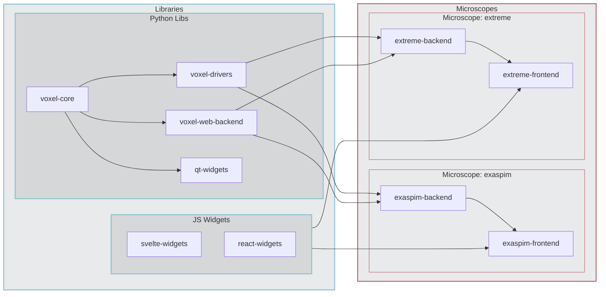

<h1>
    <div>
        
    </div>
    Voxel
</h1>

# VoxelStack Monorepo

SPIM Software Stack Monorepo

## Directory Structure

```markdown
voxel/
├── CONTRIBUTING.md            # How to get started, workspace setup, coding conventions
├── README.md                  # High-level overview + quickstart
├── libs/
│   ├── python/
│   │   ├── core/              # python package: voxel-core
│   │   ├── drivers/           # python package: voxel-drivers
│   │   ├── web-backend/       # python package: voxel-web-backend
│   │   └── qt-widgets/        # python package: voxel-qt
│   └── js/
│       ├── svelte-widgets/    # npm package: voxel-svelte-widgets
│       └── react-widgets/     # npm package: voxel-react-widgets
│
├── microscopes/
│   ├── exaspim/
│   │   ├── backend/
│   │   └── frontend/
│   └── extreme/
│       ├── backend/
│       └── frontend/
│
├── config/                     # shared YAML schemas & examples
├── docs/                      # deeper architecture and development guides
├── examples/                  # runnable demos & templates
├── scripts/                   # tooling helpers (bootstrapping, codegen)
├── tests/                     # integration tests covering Python & JS
├── pyproject.toml             # uv workspace: `libs/python/*` and `microscopes/*/backend` (python)
└── package.json               # pnpm workspace: `libs/js/*` and `microscopes/*/frontend` (javascript)
```

### Inter Package Dependency Graph


```mermaid
graph LR
  subgraph libs [Libraries]
    subgraph python-libs [Python Libs]
        voxel-core --> voxel-drivers
        voxel-core --> voxel-web-backend
        voxel-core --> qt-widgets
    end

    subgraph js-widgets [JS Widgets]
        svelte-widgets
        react-widgets
    end
  end

  subgraph microscopes [Microscopes]
    subgraph exaspim [Microscope: exaspim]
      exaspim-backend --> exaspim-frontend
    end

    subgraph extreme [Microscope: extreme]
        extreme-backend --> extreme-frontend
    end
  end

  %% Dependencies: Python libs → backends
  voxel-drivers --> exaspim-backend
  voxel-drivers --> extreme-backend
  voxel-web-backend --> exaspim-backend
  voxel-web-backend --> extreme-backend

  %% Dependencies: JS Widgets → frontends
  js-widgets --> exaspim-frontend
  js-widgets --> extreme-frontend

  %% Define reusable classes
  classDef libCluster fill:#2E3440,stroke:#88C0D0,stroke-width:2px,fill-opacity:0.1;
  classDef microscopeCluster fill:#2E3440,stroke:#BF616A,stroke-width:2px,fill-opacity:0.1;
  classDef microscopeNode fill:none,stroke:#BF616A,stroke-width:1px;

  %% Apply classes
  class libs,python-libs,js-widgets libCluster;
  class microscopes microscopeCluster;
  class exaspim,extreme microscopeNode;
```

## Contributing

This repository uses the following branching strategy:

- `main`: Contains production-ready code. Updated only for releases and
  hotfixes.
- `develop`: Default branch. Contains the latest development changes.
- `feature/*`: Used for developing new features. Branch off from and merge back
  into `develop`.
- `hotfix/*`: Used for critical bug fixes. Branch off from `main`, and merge to
  both `main` and `develop`.

Contributors should typically branch off from and create pull requests to
`develop`.

Refer to the [CONTRIBUTING.md](CONTRIBUTING.md) file for more details.
