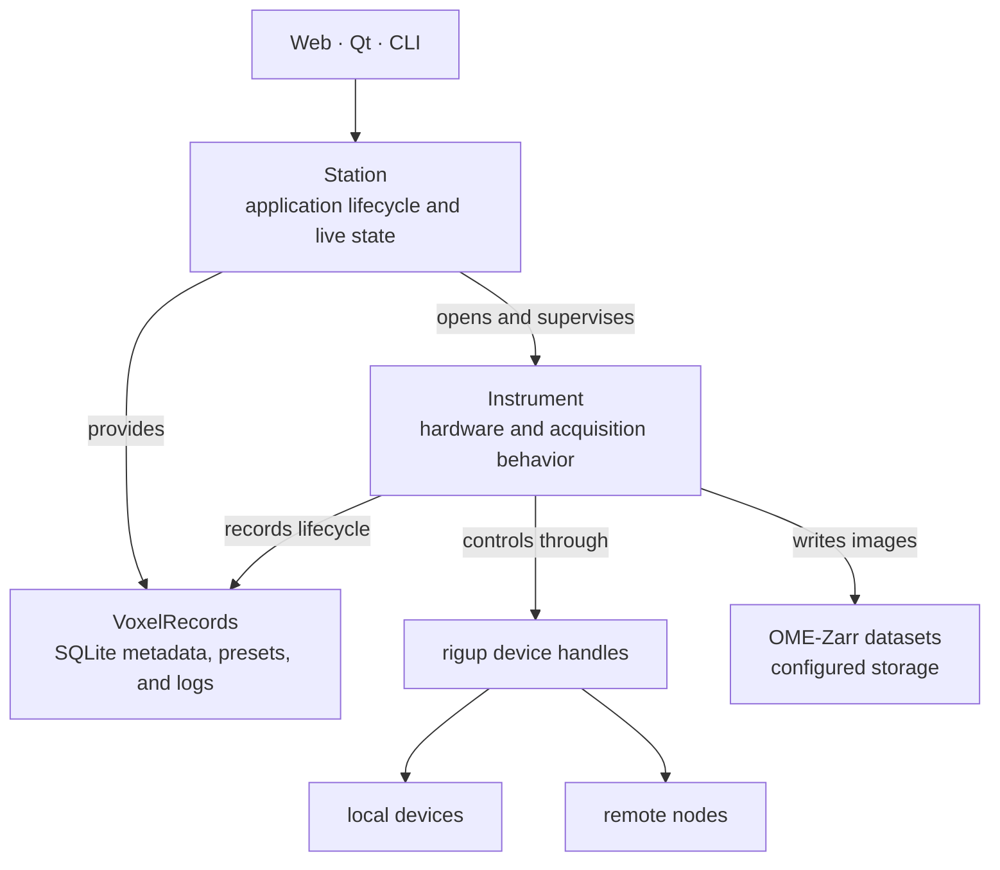

<h1>
    
    Voxel
</h1>

**Control, coordinate, and acquire with light-sheet microscopes.**

Voxel is an application-first microscopy platform built from reusable Python components. It brings local and
distributed hardware under one control model, coordinates preview and acquisition workflows, streams datasets into
storage, and records operational history through web and desktop interfaces.

> [!WARNING]
> Voxel is under active development. APIs and configuration schemas may change before the first stable release.

## Highlights

- **One microscope application** — operate a station through the Svelte web interface, with an early PySide desktop
  interface for native workflows; use the unified CLI to configure and launch the application and its device nodes.
- **Local or distributed hardware** — [rigup](rigup/) presents in-process devices and devices hosted on remote nodes
  through the same typed asynchronous API.
- **Acquisition-aware state** — configure imaging profiles, optical routing, specimen metadata, traversal, and
  acquisition tasks as validated instrument state.
- **Streaming data and preview** — deliver live preview frames while writing multiscale OME-Zarr acquisitions.
- **Durable records** — retain acquisition manifests, reusable presets, and structured operational logs in SQLite.
- **Hardware-free exploration** — run a complete simulated microscope before connecting physical devices.

## Try the simulated microscope

Voxel currently requires Python 3.13+, [uv](https://docs.astral.sh/uv/), and
[Nub](https://nubjs.com/) for building the web interface.

```bash
git clone https://github.com/AllenNeuralDynamics/voxel.git
cd voxel

uv sync --all-packages --extra web
nub install --cwd web-ui --frozen-lockfile
nub run --cwd web-ui build

uv run vxl station init --name my-microscope
uv run vxl serve
```

Open [http://localhost:8000](http://localhost:8000), create an instrument from the `simulated-local` template, and
open it. The simulated configuration exercises the application without requiring microscope hardware.

Station initialization is a one-time operation that writes `~/.voxel/station.yaml`. Remote device nodes do not need
a station configuration; they use an optional `~/.voxel/system.yaml`, `VOXEL_*` environment variables, or defaults.

The Qt interface is an early implementation and does not yet cover the complete web workflow. To try it, install the
Qt dependencies and launch the same station:

```bash
uv sync --all-packages --extra qt
uv run vxl qt
```

## Use the instrument API

The application is built around a reusable `Instrument` API. An instrument can be opened directly without creating
a `Station`; callers provide persistent records and retain explicit control of hardware lifetime.

```python
from pathlib import Path

from vxl.instrument import Instrument
from vxl_records import SQLiteRecords

records = SQLiteRecords(
    Path("records.sqlite3"),
    resolve_root=lambda spec: Path("data") / spec.path,
)
instrument = Instrument.from_path("my-microscope.voxel", records=records)

await instrument.open()
try:
    await instrument.set_active_profile("single_gfp")
    await instrument.start_preview()
finally:
    await instrument.close()
```

An instrument directory contains `config.yaml`, the hardware definition and configured defaults, and `state.json`,
the current operator-editable acquisition state.

## How Voxel fits together


```mermaid
flowchart TD
    interfaces["Web · Qt · CLI"] --> station["Station<br/>application lifecycle and live state"]
    station -->|opens and supervises| instrument["Instrument<br/>hardware and acquisition behavior"]
    station -->|provides| records["VoxelRecords<br/>SQLite metadata, presets, and logs"]
    instrument -->|records lifecycle| records
    instrument -->|controls through| rigup["rigup device handles"]
    rigup --> local["local devices"]
    rigup --> remote["remote nodes"]
    instrument -->|writes images| data["OME-Zarr datasets<br/>configured storage"]
```

- **Instrument** owns opened hardware, persisted acquisition state, preview, and acquisition behavior.
- **Station** owns application lifecycle for at most one active instrument session and publishes complete state and
  preview streams to application interfaces.
- **VoxelRecords** stores acquisition metadata, presets, and logs. Image data is written separately as OME-Zarr
  datasets to configured storage.

## Workspace packages

Voxel is a uv workspace. The root `vxl` distribution provides microscope orchestration and the application
interfaces; the other distributions have narrower library boundaries.

| Package | Responsibility |
| --- | --- |
| [`vxl`](src/vxl/) | Instrument and station runtimes, device abstractions, CLI, and web and Qt interfaces |
| [`rigup`](rigup/) | Typed local and network-transparent device control |
| [`vxl-drivers`](drivers/) | Implementations for supported cameras, stages, lasers, and related hardware |
| [`vxl-records`](records/) | SQLite-backed acquisition, preset, and log records |
| [`ome-zarr-writer`](omezarr/) | Streaming multiscale OME-Zarr writing |
| [`vxlib`](vxlib/) | Shared reactive primitives, schemas, and utilities |
| [`web-ui`](web-ui/) | SvelteKit frontend compiled into `vxl.web` package data |

The non-published [`bench`](bench/) workspace contains OME-Zarr performance and behavior benchmarks.

## Development

Choose only the application extras needed for your work, or install the complete environment:

```bash
uv sync --all-packages --all-extras --all-groups
nub install --cwd web-ui --frozen-lockfile
uvx pre-commit install
```

Run the repository checks directly with:

```bash
uv run ruff check
uv run ruff format --check
uv run basedpyright
uv run pytest
nub run --cwd web-ui check
```

For frontend development, run `nub run --cwd web-ui dev` beside `uv run vxl serve`. Build the frontend and Python
release artifacts together with `uv run scripts/build.py`.

Package-specific boundaries and workflows are documented in their respective READMEs. Types and docstrings remain
the source of truth for individual APIs.

## Feedback and license

Voxel is developed at the [Allen Institute for Neural Dynamics](https://alleninstitute.org/division/neural-dynamics/).
Questions, bug reports, and feature proposals are welcome through
[GitHub Issues](https://github.com/AllenNeuralDynamics/voxel/issues).

Voxel is distributed under the [MIT License](LICENSE).
