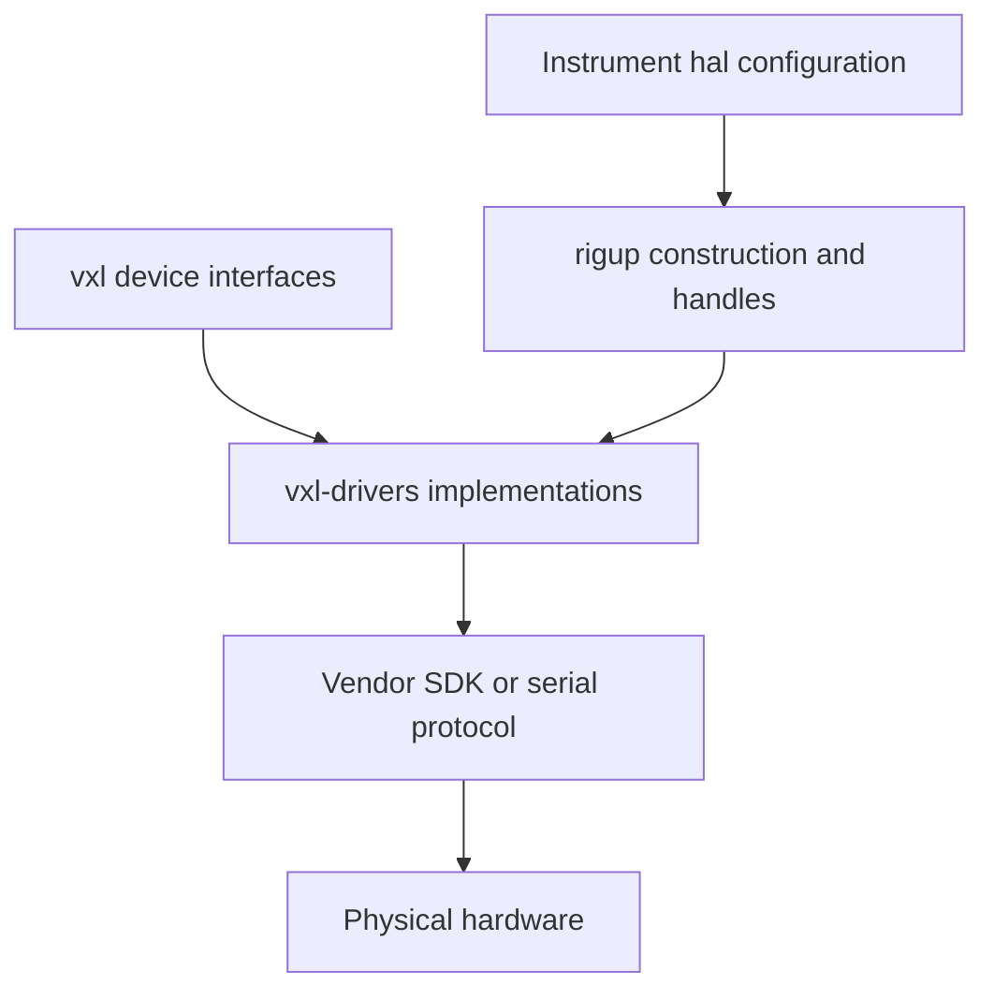

# vxl-drivers

**Connect Voxel's device interfaces to real microscope hardware.**

vxl-drivers contains the vendor-specific cameras, lasers, motion controllers, and related devices used by Voxel
instruments. The `vxl` package defines the device contracts, while [rigup](../rigup/) constructs the configured
devices and presents them through the same asynchronous handle API used for simulated hardware.

## Highlights

- **Configuration-selected hardware** — instrument configurations identify drivers by import path, without embedding
  vendor-specific construction in the instrument runtime.
- **Common device contracts** — physical cameras, lasers, AOTFs, and axes implement the interfaces defined by `vxl`.
- **Shared-controller support** — hubs own serial buses or vendor connections and are injected into colocated device
  drivers by rigup.
- **Hardware-free application development** — simulated devices remain in `vxl`; install and load this package only
  when connecting physical hardware.

## How the package fits



Application code normally controls a configured driver through a rigup `DeviceHandle`; it does not instantiate the
driver directly. This keeps local, subprocess-hosted, and remote devices on the same control surface.

## Configure hardware

Each entry in an instrument's `hal.devices` mapping names a driver `target` and its constructor `init` arguments.
rigup supplies the device UID and resolves references to other configured devices on the same node. For example, a
Tiger hub can own one controller connection shared by several axes:

```yaml
hal:
  devices:
    tiger_controller:
      target: vxl_drivers.tigerhub.TigerHub
      init: {box: COM3}

    x_axis:
      target: vxl_drivers.axes.asi.TigerLinearAxis
      init: {hub: tiger_controller, axis_label: x, units: um}
```

A hub and the devices that depend on it must run in the same process. See the [rigup README](../rigup/) for local,
subprocess, and remote-node placement.

> [!CAUTION]
> Constructing a hardware driver may immediately open a physical device. Confirm ports, addresses, limits, and laser
> safety controls before loading a real instrument configuration.

## Included integrations

These are concrete integrations present in the package. Actual operation also depends on compatible hardware,
firmware, operating-system drivers, and vendor runtimes.

### Cameras

| Hardware | Target | Python support |
| --- | --- | --- |
| Vieworks through Euresys eGrabber | `vxl_drivers.cameras.egrabber.VieworksCamera` | `egrabber-camera` extra |
| Hamamatsu DCAM cameras | `vxl_drivers.cameras.dcam.hamamatsu.HamamatsuCamera` | Bundled Python wrapper; native DCAM runtime required |
| PCO sCMOS cameras | `vxl_drivers.cameras.pco.PCOCamera` | `pco` package installed separately |
| Ximea cameras | `vxl_drivers.cameras.ximea.XimeaCamera` | `ximea-camera` extra |

### Lasers and AOTFs

| Hardware | Target | Python support |
| --- | --- | --- |
| Vortran Stradus | `vxl_drivers.lasers.vortran_stradus.VortranStradus` | `vortran-laser` extra |
| Cobolt Skyra | `vxl_drivers.lasers.cobolt_skyra.CoboltSkyra` | `pycobolt-laser` extra |
| Coherent Genesis MX | `vxl_drivers.lasers.coherent.genesis_mx.GenesisMX` | `coherent-laser` extra |
| Coherent OBIS LX and LS | `vxl_drivers.lasers.coherent.obis.ObisLX`, `ObisLS` | `obis-laser` extra |
| MPB VFL | `vxl_drivers.lasers.mpb.vfl.MpbVfl` | Serial support included |
| Oxxius LBX and LCX | `vxl_drivers.lasers.oxxius.OxxiusLBX`, `OxxiusLCX` | Serial support included |
| AA Opto-Electronic MPDSnC | `vxl_drivers.aotf.mpds.MpdsAotf` | Included dependency |

Oxxius lasers sharing a controller use `vxl_drivers.lasers.oxxius.OxxiusHub` as their configured hub.

### Motion control

| Hardware | Target | Python support |
| --- | --- | --- |
| ASI Tiger controller | `vxl_drivers.tigerhub.TigerHub` | Serial support included |
| ASI Tiger linear axis | `vxl_drivers.axes.asi.TigerLinearAxis` | Configured with a `TigerHub` |
| Micronix MMC-100 controller | `vxl_drivers.axes.mmc.MMCHub` | Serial support included |
| Micronix MMC-100 linear axis | `vxl_drivers.axes.mmc.MMCLinearAxis` | Configured with an `MMCHub` |

## Install vendor support

Install only the optional dependency needed by the hardware being configured. From the Voxel workspace, for example:

```bash
uv sync --package vxl-drivers --extra egrabber-camera
```

Available extras are listed in [`pyproject.toml`](pyproject.toml). A Python extra may provide bindings without
installing the vendor's native runtime, device driver, firmware, or license; follow the corresponding vendor's
installation requirements as well.

## Develop and validate drivers

A driver implements the appropriate `vxl` device interface and exposes its public commands and properties through
rigup. It should keep vendor-specific types behind that boundary, serialize access to shared controller resources,
and release hardware deterministically from `close()`.

Run the hardware-independent checks from the workspace root:

```bash
uv sync --all-packages --all-groups
uv run ruff check drivers
uv run basedpyright drivers
uv run pytest drivers/tests
```

These checks cannot establish compatibility with a physical device or vendor runtime. Hardware validation should
name the exact model, firmware, connection, and exercised operations.


Low-level ASI Tiger command behavior is documented separately in the
[`tigerhub/ops` reference](src/vxl_drivers/tigerhub/ops/README.md).

vxl-drivers is part of the [Voxel](../) project and is available under its [MIT license](../LICENSE).
