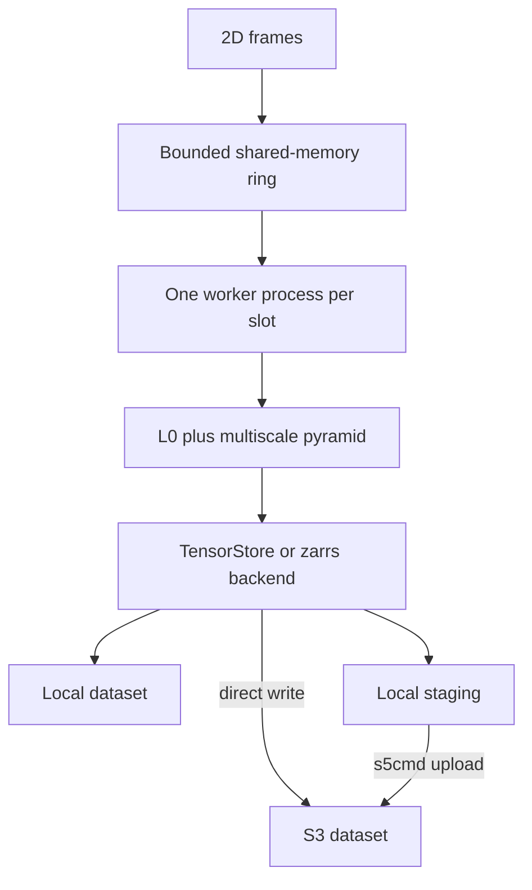

# ome-zarr-writer

**Stream microscopy frames into sharded, multiscale OME-Zarr datasets while acquisition continues.**

ome-zarr-writer accepts one two-dimensional frame at a time, assembles bounded batches in shared memory, and builds
an OME-NGFF v0.5 pyramid in worker processes. It writes Zarr v3 datasets to a local filesystem or S3 without placing
downsampling and compression work on the capture process.

> [!WARNING]
> ome-zarr-writer is under active development. Its API and output policy may change before the first stable release.

## Highlights

- **Frame-oriented ingestion** — callers provide individual NumPy frames instead of materializing a complete volume.
- **Concurrent processing** — a bounded shared-memory ring overlaps capture with pyramid generation and storage.
- **Multiscale output** — each batch is downsampled through the configured level and written as sharded Zarr v3.
- **Local and S3 storage** — write directly to either destination or stage shards on fast local storage before upload.
- **Reusable resources** — one `OMEZarrWriter` retains its expensive ring across compatible stacks.
- **Observable performance** — per-batch collection, processing, flush, transfer, and eviction metrics are written into
  each dataset.

## Write a local dataset

The default TensorStore backend is available through the `ts` extra. From this repository:

```bash
cd omezarr
uv sync --extra ts
```

The writer API is synchronous so it can be called directly from a camera acquisition loop:

```python
from pathlib import Path

import numpy as np
from ome_zarr_writer import Local, OMEZarrWriter, ScaleLevel, UIVec3D, UVec3D, WriterConfig


def main() -> None:
    config = WriterConfig(
        volume_shape=UIVec3D(z=16, y=256, x=256),
        voxel_size=UVec3D(z=1.0, y=0.5, x=0.5),
        max_level=ScaleLevel.L2,
    )
    writer = OMEZarrWriter(slots=3)
    writer.begin_stack(config, Local(target=Path("experiment/stack")))
    try:
        for z in range(config.volume_shape.z):
            with writer.new_frame() as frame:
                frame.fill(z)
    finally:
        writer.close()


if __name__ == "__main__":
    main()
```

This creates `experiment/stack.ome.zarr`; the suffix is added only when it is not already present. `close()` drains
the active stack and releases the ring. To write several volumes with the same writer, call `end_stack()` after each
volume, begin the next one, and call `close()` once at the end.

## Pipeline



`new_frame()` commits its writable slot on clean context exit and aborts it if the block raises. When every slot is
processing or retained by a reader, the next frame waits for a slot to become reusable. This bounded
backpressure prevents the writer from consuming unlimited memory or local scratch space.

`latest_frame()` returns a read-only `FrameLease` for the most recently committed frame. Close the lease when the
reader is finished so its ring slot can be reused.

The ring is reused when batch shape, pyramid depth, and dtype still match. A geometry change releases it and allocates
a replacement before opening the next stack.

## Configure a dataset

`WriterConfig` is a frozen Pydantic model. It combines acquisition geometry with the output-format settings inherited
from `WriterSettings`; the destination remains a separate storage value passed to `begin_stack()`.

| Field | Default | Purpose |
| --- | --- | --- |
| `volume_shape` | required | Complete level-0 extent in `(z, y, x)` order |
| `voxel_size` | required | Physical spacing in `(z, y, x)` order |
| `voxel_unit` | `micrometer` | Unit attached to spatial axes |
| `dtype` | `uint16` | Stored pixel type |
| `max_level` | `L7` | Deepest pyramid level; level `n` is reduced by `2ⁿ` |
| `compression` | `blosc.lz4` | Inner-chunk compression |
| `downscale_type` | `gaussian` | `gaussian`, `mean`, `min`, or `max` pyramid reduction |
| `target_shard_gb` | `1.0` | Target used to derive the lateral shard geometry |
| `shard_z_chunks` | `1` | Number of chunks along z in each shard |
| `batch_z_shards` | `1` | Number of z-shards collected in each batch |

Chunk edges are at least 64 voxels and otherwise follow the maximum pyramid factor. Batch depth is
`batch_z_shards × shard_z_chunks × 2^max_level`; these settings therefore affect both throughput and ring memory.

Each dataset contains OME-NGFF group metadata, one array per scale level, and a best-effort `metrics.json` containing
the resolved configuration and per-batch timing and byte counts.

## Choose storage

Storage values make each write path explicit:

| Storage | Behavior | Additional requirements |
| --- | --- | --- |
| `Local` | Writes arrays directly to a filesystem path | Selected array backend |
| `DirectS3` | Writes metadata and arrays directly to S3 | `S3Store` and backend S3 support |
| `StagedS3` | Writes shards to local scratch, uploads them with s5cmd, then evicts successful uploads | `s3` group and sufficient scratch space |

```python
from pathlib import Path

from cloudpathlib import S3Path
from ome_zarr_writer import S3Store, StagedS3

storage = StagedS3(
    target=S3Path("s3://my-bucket/acquisitions/stack"),
    scratch=Path("/fast/scratch/stack.ome.zarr"),
    store=S3Store(region="us-east-1"),
)
```

`S3Store` selects an endpoint, region, and credential strategy; secrets remain in the standard AWS credential chain.
For staged writes, `StagingConfig.max_pending` bounds queued uploads. A failed upload is surfaced and its local shard
is retained rather than evicted.

## Choose an array backend

TensorStore is the default. The zarr-python backend uses the zarrs Rust codec pipeline. Both currently support local
and direct S3 targets.

```python
from ome_zarr_writer import OMEZarrWriter
from ome_zarr_writer.array import ArrayWriter

writer = OMEZarrWriter(backend=ArrayWriter.Backend.ZARRS, slots=3)
```

Install the corresponding package extras:

```bash
uv sync --extra ts       # TensorStore
uv sync --extra zarrs    # zarr-python + zarrs
uv sync --extra s3       # cloudpathlib S3 support and s5cmd for staged uploads
```

## Size the ring

The writer knows the cost of one slot but intentionally does not decide how much machine RAM it may consume. A host
application can pass a `sizer` to `begin_stack()` and use `ome_zarr_writer.sizing.slots_for_budget()` to convert its
own byte budget into a ring depth.

The sizing model includes shared memory, float32 pyramid intermediates, and cast buffers. It distinguishes a
configuration that cannot fit its assigned budget from a transient lack of currently available machine memory.
Explicit `slots=` remains useful for small programs and benchmarks.

## Development

From the Voxel workspace root:

```bash
uv sync --all-packages --all-extras --all-groups
uv run ruff check omezarr
uv run basedpyright omezarr
uv run pytest omezarr/tests -m "not slow"
```

Run `uv run pytest omezarr/tests` for the complete suite. S3 integration tests use a temporary MinIO container and
skip when Docker is unavailable. Runnable local, S3, and Neuroglancer examples live in [`examples/`](examples/).

ome-zarr-writer is part of the [Voxel](../) project and is available under its [MIT license](../LICENSE).
