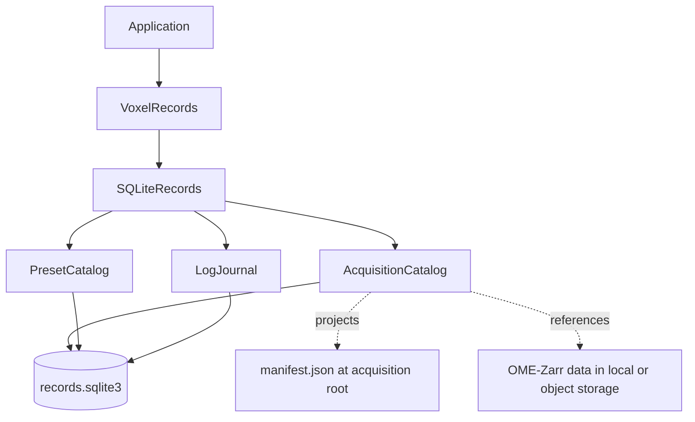

# vxl-records

**Keep acquisition history, reusable presets, and operational logs behind one durable API.**

vxl-records is the persistence boundary for Voxel applications. It stores revisioned acquisition manifests,
instrument-scoped preset payloads, and an ordered structured log journal in SQLite. Image data remains in its local or
object-store datasets; records describe its identity, lifecycle, and locations.

## Highlights

- **One composed boundary** — applications receive acquisitions, presets, and logs through `VoxelRecords`.
- **Lifecycle-aware acquisitions** — validated transitions keep acquisition, volume, dataset, and location outcomes
  coherent.
- **Revisioned authority** — SQLite stores the authoritative manifest revision with optimistic conflict detection.
- **Portable projections** — a current `manifest.json` is written beside each acquisition's data without becoming a
  second catalog.
- **Ordered log journal** — sequence cursors support paging, live committed-entry subscriptions, and exact acquisition
  windows.
- **Non-blocking capture** — Python log records enter a bounded queue; one worker persists them without blocking the
  emitting thread.

## Planned work

- **Log retention** — configurable lifetimes by log level, with older entries pruned by recording time in bounded
  maintenance work. Logs inside an open acquisition window will remain protected, and pruning will not run on the
  log-emission path.

## Create a record store

Within the Voxel workspace:

```bash
uv sync --package vxl-records
```

`SQLiteRecords` needs a database path and a function that resolves a portable `StorageSpec` to the acquisition's
concrete local or S3 root:

```python
import datetime
from pathlib import Path, PurePosixPath
from uuid import uuid4

from vxl_records import (
    AcquisitionManifest,
    AcquisitionOrigin,
    AcquisitionVolume,
    SQLiteRecords,
    StorageSpec,
)

records = SQLiteRecords(
    Path("records.sqlite3"),
    resolve_root=lambda storage: Path("acquisitions") / storage.path,
)

acquisition_id = uuid4()
manifest = AcquisitionManifest(
    id=acquisition_id,
    instrument="microscope-1",
    origin=AcquisitionOrigin(host="controller-1", operator="operator"),
    created_at=datetime.datetime.now(tz=datetime.UTC),
    storage=StorageSpec(path=PurePosixPath("runs") / str(acquisition_id)),
    state_snapshot={},
    hardware_snapshot={},
    volumes=[AcquisitionVolume(task="tile-1", profile="488-nm")],
)

created = await records.acquisitions.create(manifest)
running = await records.acquisitions.start_acquisition(created.id)
with_running_volume = await records.acquisitions.start_volume(running.id, task="tile-1", profile="488-nm")
with_completed_volume = await records.acquisitions.complete_volume(
    with_running_volume.id,
    task="tile-1",
    profile="488-nm",
)
completed = await records.acquisitions.complete_acquisition(with_completed_volume.id)
```

The database is created and migrated when `SQLiteRecords` is instantiated. Operations use short-lived connections, so
the composed object has no separate open or close lifecycle.

## How the pieces fit together



`VoxelRecords` is the application-facing protocol; `SQLiteRecords` implements it over one local database. This keeps
instrument code coupled to record capabilities rather than database setup or a particular user interface.

## Acquisition records

An `AcquisitionManifest` is an immutable Pydantic record containing:

- a stable acquisition ID and monotonically increasing revision;
- instrument and origin information;
- portable storage intent;
- state and hardware snapshots captured at acquisition start;
- planned task/profile volumes and their channel datasets;
- lifecycle timestamps, outcome, and transport-safe failure information.

The catalog owns transitions rather than accepting arbitrary manifest replacement. Its principal operations are:

```text
create → start acquisition
       → start volume → register datasets → complete/fail/cancel volume
       → complete/fail/cancel acquisition
```

Every changed transition increments the revision. Invalid transitions raise `InvalidTransitionError`; a concurrent
revision change raises `RevisionConflictError`. Failing or cancelling an acquisition also terminalizes unfinished
volumes according to the lifecycle rules.

SQLite commits before the catalog writes the acquisition-root `manifest.json`. If projection fails,
`ManifestSyncError` reports that the database revision is already durable; `sync_manifest()` can regenerate the file
from SQLite. Archiving hides a record from normal acquisition queries without deleting acquired data or its portable
manifest.

`StorageSpec` remains machine-independent. The resolver supplied to `SQLiteRecords` decides how a station or service
maps that logical destination to a concrete `Path` or `S3Path` when writing the projection.

## Operational logs

`LogJournal.capture()` installs a root Python logging handler for an explicit application-lifecycle context:

```python
import logging

async with records.logs.capture(level=logging.INFO):
    logging.getLogger("microscope.camera").info("Preview started")
    durable_through = await records.logs.mark()
```

The handler performs no SQLite work on the emitting thread. It captures the timestamp, level, logger, rendered
message, optional `node_id`, and exception details into a bounded queue. When the queue overflows, omitted records are
represented by a durable warning entry instead of being silently lost.

`mark()` waits until everything admitted before the barrier is durable and returns the latest sequence. Subscribers
are likewise called only after an entry commits. Use `append()` when structured `attributes` or an externally emitted
entry should be supplied directly rather than captured from Python logging.

Queries are sequence-based:

- `query()` pages forward from `after_seq` and can filter by upper cursor, minimum level, or node;
- `tail()` returns the newest entries in ascending order;
- `subscribe()` publishes newly committed `LogEntry` values;
- `open_acquisition_window()` and `close_acquisition_window()` store sequence boundaries on the acquisition row;
- `for_acquisition()` queries the shared journal within those boundaries without copying log data.

Only one capture context may be active for a journal at a time. Capture should therefore be owned by the application
lifecycle, not opened around individual operations.

## Presets

`PresetCatalog` stores immutable `PresetRecord` values with a stable ID, instrument name, display name, creation time,
and JSON payload. Names are unique within an instrument; the same name may be used by another instrument.

The payload is intentionally generic. The host application validates it against its current preset model before
applying it, so vxl-records does not need to know whether the value came from the current instrument state, an older
acquisition, or another compatible source. Presets can be listed by instrument, fetched by ID, created, and permanently
deleted.

## SQLite behavior

The database uses WAL mode, foreign-key enforcement, immediate write transactions, and `synchronous=FULL`. Packaged,
numbered migrations apply automatically. An application ID prevents accidentally opening an unrelated SQLite file,
and databases newer than the installed package are rejected rather than downgraded.

`SQLiteRecords` is designed for a single station, and its database should live on local reliable storage.

## Development

From the Voxel workspace root:

```bash
uv sync --all-packages --all-groups
uv run ruff check records
uv run basedpyright records
uv run pytest records/tests
```

vxl-records is part of the [Voxel](../) project and is available under its [MIT license](../LICENSE).
