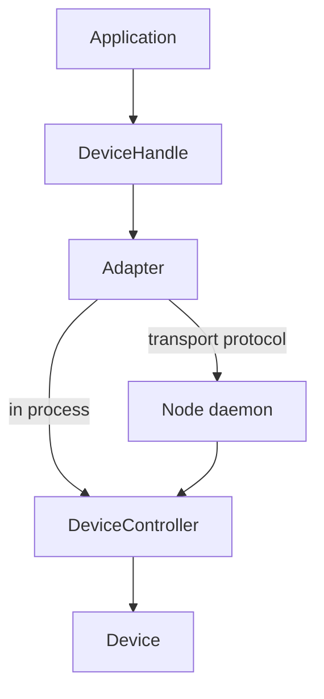

# rigup

**Control Python hardware through one asynchronous API, whether devices run locally, in a managed subprocess, or on
another machine.**

rigup is a hardware-control library for applications that need process isolation or distributed device hosting
without maintaining separate client APIs. Drivers expose commands and properties, a `Rig` constructs the requested
topology, and callers interact with every device through a `DeviceHandle`.

> [!WARNING]
> rigup is under active development. Its public API and wire protocol may change before the first stable release.

## Highlights

- **Location-transparent handles** — the same calls control in-process, subprocess, and remote devices.
- **Discoverable interfaces** — commands, properties, constraints, and presentation metadata are derived from the
  driver and represented by validated models.
- **Hardware-safe execution** — synchronous calls for each device run on a dedicated single-worker executor, while
  separate devices remain independent.
- **Reactive properties** — streamed observations update one latest-successful cache shared by typed handle views and
  subscribers.
- **Explicit lifecycle** — `Rig` builds devices, reports partial build failures, and closes devices and managed
  processes deterministically.

## Define a device

A driver subclasses `Device`. Only methods and properties marked with `@describe` become part of its public
interface. Constrained property descriptors validate writes and carry their bounds or options across the handle
boundary.

```python
from enum import StrEnum

from rigup import Device, describe, numeric


class LaserState(StrEnum):
    OFF = "off"
    ON = "on"


class Laser(Device[LaserState]):
    __DEVICE_TYPE__ = "laser"

    def __init__(self, uid: str) -> None:
        super().__init__(uid)
        self._power = 0.0
        self._enabled = False

    @numeric(minimum=0.0, maximum=100.0, step=0.1)
    @describe(label="Power", units="mW", stream=True)
    def power(self) -> float:
        return self._power

    @power.setter
    def power(self, value: float) -> None:
        self._power = value

    @describe(label="Enable")
    def enable(self) -> None:
        self._enabled = True
```

`stream=True` asks the controller to poll the property and publish changed observations. It is appropriate for live
telemetry, not for events that require lossless delivery.

## Build and use a rig

`RigConfig` is a Pydantic model; an application may construct it directly or validate configuration loaded from
YAML or another source. Each target is the import path of a `Device` subclass.

```python
import asyncio

from rigup import DeviceConfig, Rig, RigConfig


async def main() -> None:
    config = RigConfig(
        devices={
            "laser": DeviceConfig(
                target="my_devices.Laser",
                defaults={"power": 5.0},
            )
        }
    )
    rig = Rig(config, name="example")

    await rig.open()
    try:
        laser = rig.devices["laser"]
        await laser.call("enable")
        await laser.props.set(power=12.5)
        print(await laser.props.get_value("power"))
    finally:
        await rig.close()


asyncio.run(main())
```

`DeviceHandle.call()` returns the command value and raises when the operation fails. `run_command()`, batched
commands, and property operations expose `Result` models when the caller needs per-operation error handling.

Successful property reads, writes, and stream observations enter `handle.props.cache`. Subscribe to `handle.props`
for complete cache snapshots, or use `handle.props.property(name, parser)` in a typed handle subclass for one parsed,
subscribable property.

## Place devices

Top-level `devices` run in the application process. Entries under `nodes` run elsewhere:

```yaml
devices:
  laser:
    target: my_devices.Laser

nodes:
  isolated_camera:
    kind: subprocess
    devices:
      camera:
        target: my_devices.Camera

  motion_host:
    kind: remote
    address: tcp://192.168.1.20:5555
    devices:
      stage:
        target: my_devices.Stage
```

| Placement | Lifecycle | Communication |
| --- | --- | --- |
| Top-level device | Constructed and closed in the application process | Direct adapter; no serialization |
| Subprocess node | Spawned and terminated by `Rig` | ZeroMQ over a temporary IPC endpoint by default |
| Remote node | Supervised independently and claimed while the rig is open | ZeroMQ over configured TCP or IPC endpoints |

If `kind` is omitted, no address or a local-only address selects `subprocess`; a non-local TCP address selects
`remote`. An explicit `kind` always wins.

Device UIDs must be unique across the complete rig. A constructor argument may refer to another configured device by
UID, but both devices must occupy the same process. Independent targets within a dependency layer can initialize in
parallel; devices sharing a target class initialize sequentially to protect SDKs with shared process state.

## Run a remote node

Start the daemon on the device host, using the node ID declared by the controlling rig:

```bash
rigup-node motion_host --address tcp://0.0.0.0:5555
```

The TCP RPC endpoint uses the configured port and the stream endpoint uses the following port, so this example needs
ports `5555` and `5556` available on the trusted LAN. The controlling rig sends the device build configuration after
connecting. A claim/release handshake prevents two rigs from controlling the daemon concurrently, but the current
transport does not provide authentication or encryption.

Node logs are forwarded into the controlling process's Python logging system. Log and device streams use a lossy
publish/subscribe channel so they cannot back-pressure hardware operations; commands and explicit property reads and
writes use the reliable request channel.

## Architecture



- `Device` is the synchronous, hardware-facing abstraction.
- `DeviceController` discovers the public interface, runs synchronous hardware calls, and publishes streams.
- An adapter provides the common asynchronous command, property, and subscription contract.
- `DeviceHandle` is the application-facing API; subclasses can add typed convenience methods and properties.
- `Rig` constructs nodes and devices from configuration and owns their runtime lifecycle.

The protocol uses Pydantic payload models and MessagePack serialization. Request/response and notification traffic
travels over a reliable DEALER/ROUTER channel; high-rate streams travel separately over PUB/SUB. Application code
should use handles rather than construct protocol frames directly.

## Develop rigup

From the Voxel workspace root:

```bash
uv sync --all-packages --all-groups
uv run ruff check rigup
uv run basedpyright rigup
uv run pytest rigup/tests
```

Use `uv run pytest rigup/tests -m "not slow"` to omit transport and subprocess integration tests.

Device implementations intended for Voxel live in [`vxl-drivers`](../drivers/) or alongside Voxel's vendor-neutral
device interfaces. rigup itself remains independent of microscope acquisition and user-interface concerns.

rigup is part of the [Voxel](../) project and is available under its [MIT license](../LICENSE).
