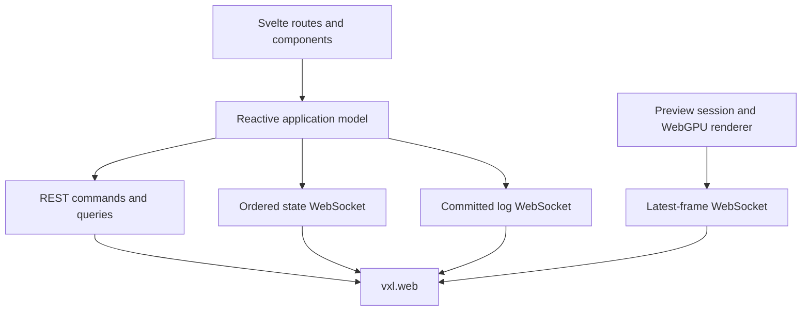

# Voxel web interface

**Operate a Voxel station from the browser.**

web-ui is the Svelte application served by `vxl.web`. It covers the instrument library and presets, live hardware
inspection and configuration, acquisition planning and execution, preview rendering, and recorded acquisitions and
logs. It is an application-specific client of the Voxel API rather than a standalone component library.

## Architecture



The backend exposes four distinct communication paths:

| Path              | Purpose                                              | Delivery behavior                                     |
| ----------------- | ---------------------------------------------------- | ----------------------------------------------------- |
| REST              | Commands, mutations, discovery, and one-shot queries | Request/response                                      |
| State WebSocket   | Complete `StationFeedView` values                    | Reliable and ordered; reconnect with a fresh view     |
| Preview WebSocket | Versioned binary preview packets                     | Latest-frame delivery; slow consumers may skip frames |
| Log WebSocket     | Structured entries committed to the log journal      | Bounded live delivery, supplemented by REST history   |

The application model under `src/lib/model/` owns backend discovery, connection lifecycle, the current station view,
and device-facing models. Routes and components consume that model rather than opening their own state connection.
Preview frames are received and decompressed in a worker, then rendered with WebGPU.

## Develop against Voxel

Install the frontend dependencies and start the Python backend from the workspace root:

```bash
uv sync --all-packages --extra web
nub install --cwd web-ui --frozen-lockfile
uv run vxl serve
```

In another terminal, run the Vite development server:

```bash
nub run --cwd web-ui dev
```

Open the URL reported by Vite. During development, `/api` requests are proxied to `http://localhost:8000`; discovery
responses provide the state, preview, and log WebSocket URLs. Set `VITE_API_URL` when the backend is running at a
different origin.

Live preview requires a browser with WebGPU support. The rest of the application can still load when WebGPU is
unavailable, but preview rendering reports an error.

## Backend contracts

The TypeScript definitions in [`src/lib/model/types.ts`](src/lib/model/types.ts) mirror the Python models serialized
by `vxl.web`. They are not generated, so a backend wire-model change must update both sides in the same change.

Preview framing has an additional versioned contract implemented in
[`src/lib/preview/protocol.ts`](src/lib/preview/protocol.ts) and its Python counterpart under `vxl.preview`. A protocol
change must update the producer, parser, advertised version, and decoder worker together. Preview decoding uses
MessagePack metadata and Zstandard-compressed 16-bit image data.

Keep transport behavior in the application model or preview transport layer. Components should express user intent
through those models and render their reactive state rather than parsing wire payloads directly.

## Build the packaged interface

```bash
nub run --cwd web-ui build
```

The static adapter writes the production SPA directly to `src/vxl/web/static/`. That directory is generated, ignored
by Git, and included as package data when Voxel is built; do not edit its contents manually. The FastAPI application
serves these files from `/` and falls back to `index.html` for client-side routes.

Build the web interface and Python release artifacts together with:

```bash
uv run scripts/build.py
```

## Validate changes

From the workspace root:

```bash
nub run --cwd web-ui check
nub run --cwd web-ui build
```

`check` runs Svelte and TypeScript validation, formatting checks, and ESLint. A production build additionally catches
static-adapter, worker, and bundling failures.

## Third-party licenses

The frontend uses [`@bokuweb/zstd-wasm`](https://github.com/bokuweb/zstd-wasm) as a fallback for browsers without
native Zstandard decompression. Its TypeScript glue is MIT-licensed, while the compiled Zstandard decoder uses the
BSD 3-Clause License. Packaged releases must include the applicable notices in `THIRD_PARTY_NOTICES.md`.

web-ui is part of the [Voxel](../) project and is available under its [MIT license](../LICENSE).
